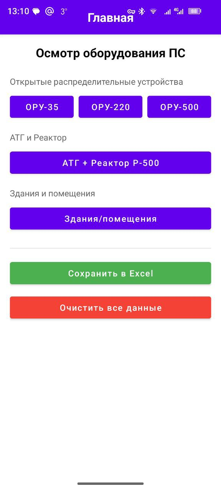
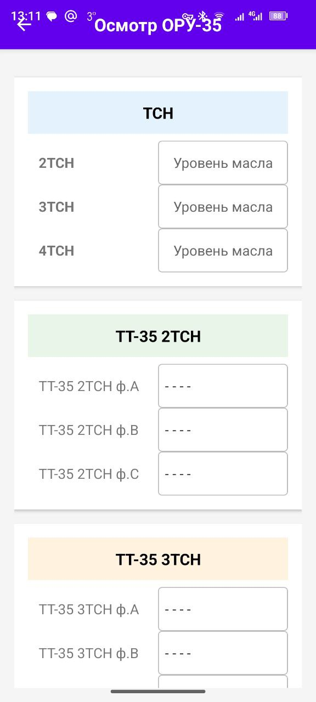

# ОсмотрПС - Приложение для технических инспекций подстанций

<div align="center">

[](https://kotlinlang.org)
[](https://www.android.com)
[](https://developer.android.com)
[](https://opensource.org/licenses/MIT)
[](https://github.com/your-username/ps-inspection)

**Профессиональное решение для проведения технических инспекций на подстанциях 500кВ**

</div>

## 📱 О проекте

**ОсмотрПС** - специализированное мобильное приложение для проведения полномасштабных технических инспекций оборудования подстанций. Приложение позволяет инженерам и техническому персоналу эффективно фиксировать параметры оборудования, сохранять данные и экспортировать их в удобном формате.

## ✨ Возможности

### 🔍 Комплексный осмотр оборудования
- **ОРУ-35, ОРУ-220, ОРУ-500** - полный осмотр открытых распределительных устройств
- **АТГ и Реакторы** - контроль силовых трансформаторов и реакторного оборудования  
- **Здания и помещения** - инспекция вспомогательных сооружений

### 📊 Структурированный сбор данных
- Ввод технических параметров (уровни масла, давления, температуры)
- Пофазный учет данных для трехфазного оборудования
- Валидация вводимых значений

### 💾 Надежное хранение и экспорт
- Локальное сохранение всех данных инспекций
- Экспорт в Excel для дальнейшего анализа и отчетности
- Функция полной очистки данных

## 🛠 Технологический стек

**Основные технологии:**
- **Язык:** Kotlin
- **UI:** XML Layouts + ViewBinding
- **Архитектура:** MVVM
- **Навигация:** Android Navigation Component
- **Асинхронность:** Kotlin Coroutines, LiveData
- **Работа с данными:** Shared ViewModel

**Библиотеки:**
```kotlin
// Android Jetpack
implementation(libs.androidx.core.ktx)
implementation(libs.androidx.appcompat)
implementation(libs.material)
implementation(libs.androidx.navigation.fragment.ktx)
implementation(libs.androidx.navigation.ui.ktx)

// Architecture Components
implementation(libs.androidx.lifecycle.viewmodel.ktx)
implementation(libs.androidx.lifecycle.livedata.ktx)
implementation(libs.androidx.lifecycle.runtime.ktx)

// Excel export
implementation(libs.poi)
implementation(libs.poi.ooxml)
📸 Интерфейс приложения
<div align="center">
Главный экран

Экран осмотра ТСН

Демо-видео работы
https://img.shields.io/badge/%F0%9F%93%B9-%D0%A1%D0%BC%D0%BE%D1%82%D1%80%D0%B5%D1%82%D1%8C_%D0%B4%D0%B5%D0%BC%D0%BE-blue.svg

</div>
🏗 Архитектура проекта
text
app/
├── src/main/
│   ├── java/com/example/ps_inspection/
│   │   ├── ui/
│   │   │   ├── fragments/          # Фрагменты с XML layout
│   │   │   └── adapters/           # Адаптеры для списков
│   │   ├── viewmodel/              # SharedInspectionViewModel
│   │   ├── data/                   # Модели данных
│   │   └── excel/                  # Логика экспорта в Excel
│   ├── res/
│   │   ├── layout/                 # XML макеты
│   │   ├── values/                 # Ресурсы, строки
│   │   └── navigation/             # Навигационный граф
│   └── assets/                     # Шаблоны Excel
Ключевые компоненты:
SharedInspectionViewModel - централизованное управление данными инспекций

Fragment-based UI - модульная архитектура экранов

Excel Export Service - генерация отчетов в формате XLSX

🚀 Установка и сборка
Предварительные требования

Android Studio Arctic Fox или новее

Android SDK 26+

Kotlin 1.9.0+

Сборка проекта
bash
git clone https://github.com/your-username/ps-inspection.git
cd ps-inspection
./gradlew assembleDebug
Установка на устройство
bash
./gradlew installDebug

📖 Как пользоваться

Запустите приложение на Android устройстве

Выберите тип оборудования для инспекции

Заполните параметры согласно техническим требованиям

Сохраните данные - автоматическое сохранение в локальную БД

Экспортируйте в Excel для создания отчетов

🔧 Для разработчиков
Структура данных
Приложение использует отдельные data-классы для каждого типа оборудования:

InspectionORU35Data, InspectionORU220Data, InspectionORU500Data

InspectionATGData - данные по АТГ и реакторам

Расширение функциональности
Для добавления нового типа оборудования:

Создать соответствующий data-класс

Добавить фрагмент с XML layout

Обновить SharedViewModel

Добавить навигацию в граф

## 📄 Лицензия

[](https://opensource.org/licenses/MIT)

Этот проект распространяется под лицензией MIT. Подробнее см. в файле [LICENSE](LICENSE).

👤 Автор
Твое имя
📧 Email: твой@email.com
💼 GitHub: @твой-ник
📱 Telegram: @твой-ник

<div align="center">
⭐ Если проект был полезен, поставьте звезду!
ОсмотрПС - профессиональный инструмент для энергетиков ⚡

</div> ```
