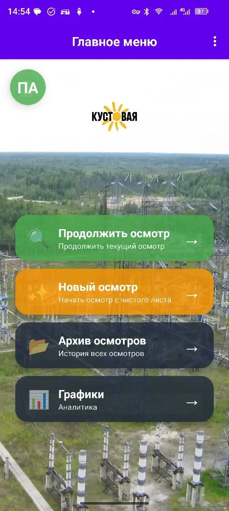
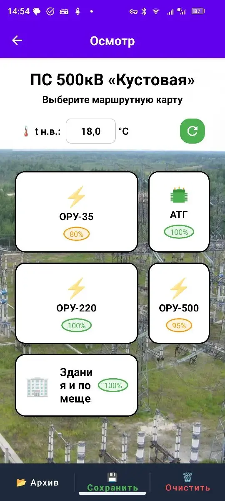
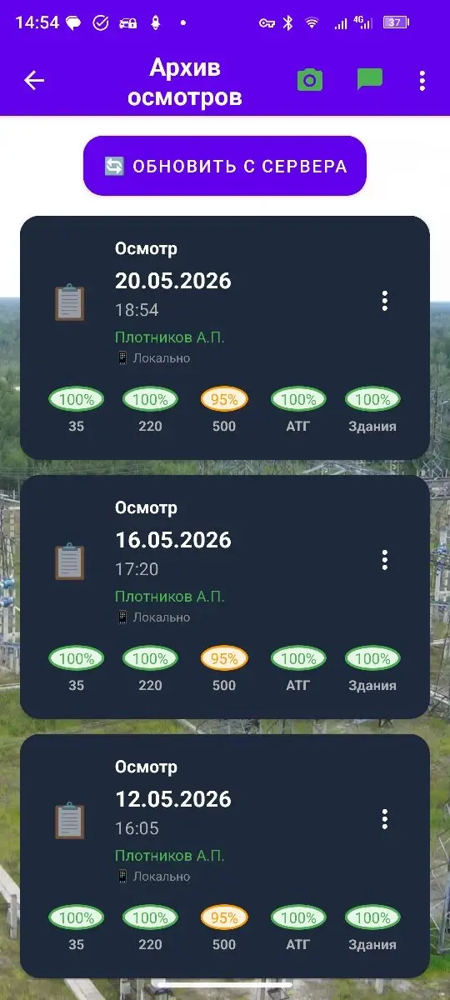
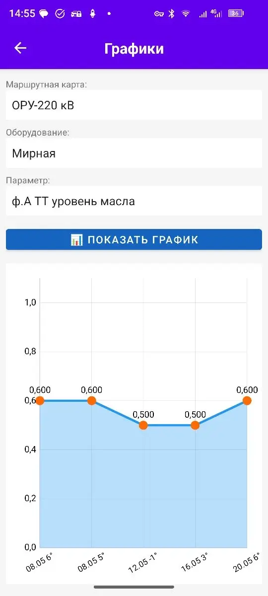

# ⚡ Осмотр ПС

Мобильное приложение для цифровизации оперативных осмотров оборудования подстанции 500 кВ.

## 🎯 Назначение

Замена бумажных бланков осмотров на электронный формат с синхронизацией в облаке, построением графиков и экспортом в Excel.

## 📱 Возможности

- **Электронные бланки** всех маршрутных карт (ОРУ-35/220/500, АТГ, Реактор, Здания)
- **Облачная синхронизация** через Google Sheets — данные доступны всем дежурным сразу
- **Графики показателей** — изменение температуры, давления, уровня масла по времени
- **Комментарии** к оборудованию с фиксацией автора и времени
- **Фотофиксация** дефектов с привязкой к единице оборудования и автору
- **Экспорт в Excel** с сохранением форматирования бланка
- **Разграничение доступа** (ДИП / ДЭМ)
- **Автозаполнение** прочерков в ячейках, не предусмотренных картой, оборудования в ремонте

## 🛠 Технологии

- **Язык:** Kotlin
- **Платформа:** Android (min SDK 26)
- **Облако:** Google Sheets API
- **Графики:** AndroidPlot
- **Excel:** Apache POI
- **Архитектура:** MVVM + ViewBinding + Navigation Component

## 📸 Скриншоты

| Главный экран | Бланк осмотра | Архив осмотров | Графики |
|:---:|:---:|:---:|:---:|
|  |  |  |  |

## 🚀 Установка

1. Склонируйте репозиторий:
git clone https://github.com/NubieLazyBill/ps_inspection.git

2. Откройте проект в Android Studio

3. Добавьте файл service_account.json в папку app/src/main/assets/

4. Соберите и запустите
